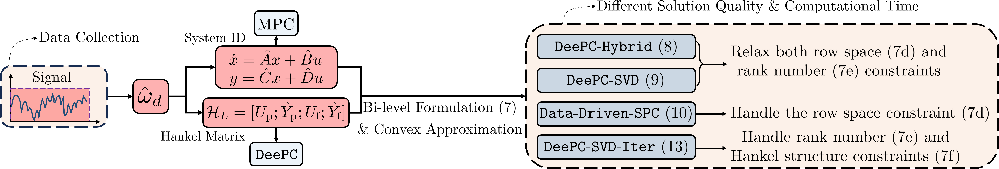

# Convex Approximation for DeePC
In this project, we introduce a new bi-level optimization formulation and discuss a series of its convex approximations by relaxing some hard constraints. This repository contains the MATLAB scripts for reproducing the experiments in our paper.

## Convex Approximations for a Bi-level Formulation of Data-Enabled Predictive Control (DeePC)

Data-EnablEd Predictive Control (*DeePC*) combines behavioral theory with receding horizon control has received increasing attention. It is first established for LTI systems and has been extended and applied for practical systems beyond LTI settings which has shown promising results. However, the relationship between different  *DeePC*  variants, involving regularization and dimension reduction, remains unclear. 

In this paper, we introduce a new bi-level formulation incorporating both system ID techniques and predictive control, and discuss how existing and new variants of  *DeePC*  can be considered as convex approximations of this bi-level formulation. Notably, a novel variant called *DeeP-SVD-Iter* has shown remarkable empirical performance on systems beyond deterministic LTI settings.
<figure>
  
<figure>

Schematic of data-driven control

<figure>
  
<figure>

Bi-level Formulation

## Dependency
The code requires the installation of [Mosek](https://www.mosek.com/) and the plot requires function [multiple_boxplot](https://www.mathworks.com/matlabcentral/fileexchange/47233-multiple_boxplot-m). 

## Instruction
### Non-deterministic LTI System

 - The `main_linear_100` and `main_linear_Hyper` can be used to reproduce results for non-deterministic LTI system with different pre-collected trajectories and different hyperparameters. The pre-collected trajectories are in `Non_deterministic_LTI\data_100`. 
 - The results for reproducing Fig. 2 are in `result_eq_all`, `result_eq_Hy_SVD` and `result_eq_Hy_SVD_SPC` and the figure is plotted by the `plot_traj`. 
 - The results for reproducing Fig. 3 are in `results_Hyper` and the figure is plotted by the `plot_cost`. 
 - The results for reproducing Table 1 and Fig. 4 are in `results_100exp` and the figure is also plotted by `plot_traj`.  
### Nonlinear System:
- The `main_Nonlinear_100` and can be used to reproduce results for systems with various of nonlinearity with different pre-collected trajectories. The pre-collected trajectories are in `Nonlinear\data_100`. 
- The results for reproducing Fig. 5 and Fig. 6 are in `results_100Exp`. The Fig. 5 and Fig. 6 are plotted by `plot_avg_cost` and `plot_avg_cost_var`, respectively. 

# Contact us
To contact us about robust DeeP-LCC, email either [Xu Shang](mailto:x3shang@ucsd.edu?Subject=Convex-Approximation-for-DeePC) or [Yang Zheng](mailto:zhengy@eng.ucsd.edu?Subject=Convex-Approximation-for-DeePC).
